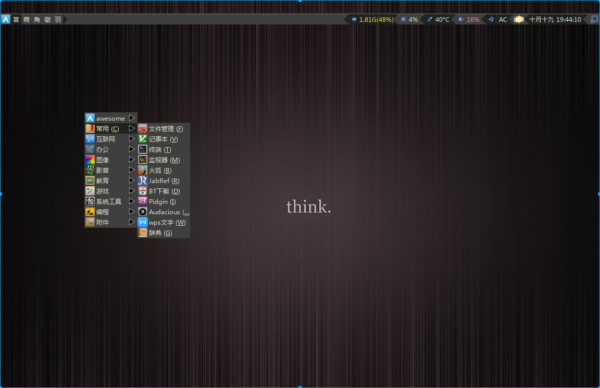
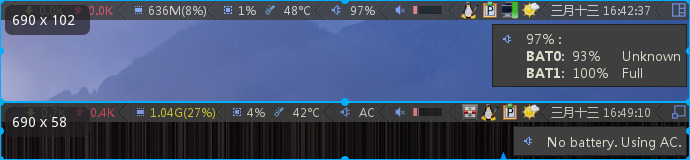
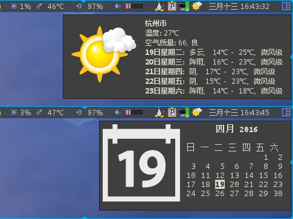

My Awesome WM Config Files
==========================

Preview:
--------

* archmenu



* laptop with 2 batterys, desktop without battery



* weather, calendar



Usage:
------

```
mv ~/.config/awesome ~/.config/awesome.old
git clone --recursive https://github.com/shmilee/config-awesome.git ~/.config/awesome
cd ~/.config/awesome
ln -s rc-default.lua rc.lua
```

Update:
-------

```
cd ~/.config/awesome
git stash
git pull
git submodule update --init --recursive
git stash pop
```
